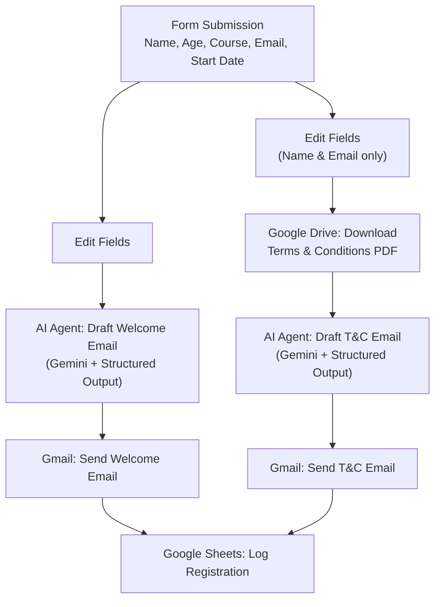

# AI-Powered Student Onboarding Automation

> An n8n workflow that automates student registration, AI-personalized welcome emails, AI-generated terms & conditions emails, and record-keeping — all triggered by a single form submission.

## Overview

This workflow automates the onboarding process for new students registering for a course (e.g. AI Automation, Software Engineering). The moment a prospective student fills out the registration form, the workflow:

1. Captures their details (name, age, course, email, start date)
2. Uses **Google Gemini** (via an AI Agent) to draft and send a personalized welcome email
3. Downloads the official onboarding terms & conditions PDF from **Google Drive** and uses Gemini to draft and send a personalized terms & conditions email based on that document
4. Logs the registrant's information to a **Google Sheet** for record-keeping

All of this happens automatically, with zero manual intervention — turning a single form submission into a complete, personalized onboarding sequence.

## How It Works

## Branch Breakdown

### 🟦 Branch 1 — Welcome Email
- **Input**: full form fields
- **AI Agent** drafts a professional welcome message confirming successful registration and letting the student know a follow-up onboarding email is on its way
- **Structured Output Parser** forces the AI's response into a clean `{ Subject, Body }` JSON shape
- **Gmail node** sends the email using that subject/body
- Feeds into the Google Sheets logging step

### 🟩 Branch 2 — Terms & Conditions Email
- **Input**: name + email only
- **Google Drive node** downloads the onboarding terms & conditions PDF — the official onboarding terms document
- **AI Agent** reads the PDF and drafts a personalized terms & conditions email referencing the student's upcoming onboarding activities
- Same structured-output → Gmail-send pattern as Branch 1
- Also feeds into the Google Sheets logging step

### 🟨 Record Keeping
- **Google Sheets ("Append row")** logs Name, Email, Course, Date of Registration, and Date of Enrollment for every registrant — building a live, always-up-to-date roster

## Tech Stack

| Tool | Role |
|---|---|
| **n8n** | Workflow orchestration |
| **Google Gemini** (`@n8n/n8n-nodes-langchain`) | LLM for personalized copywriting |
| **Structured Output Parser** | Enforces consistent Subject/Body JSON from the LLM |
| **Gmail API** | Automated email delivery |
| **Google Drive API** | Source-of-truth document retrieval (T&Cs PDF) |
| **Google Sheets API** | Lightweight registrant database |

## Why This Is Useful

- Removes manual admin overhead from the course registration process
- Every email is genuinely personalized — not a static mail-merge template
- Terms & conditions content stays in sync with the source PDF: update the PDF once, every future email reflects it
- Registrant data is automatically centralized for reporting and follow-up

## Setup Notes (if reproducing)

1. Replace the form trigger fields/options to match your own course catalog
2. Connect your own Gmail, Google Drive, and Google Sheets OAuth credentials
3. Add your own Google Gemini API credentials
4. Update the Google Drive file ID to point to your own terms & conditions document
5. Point the Google Sheet ID/sheet name at your own roster spreadsheet

## Possible Improvements

- Add error handling for failed/invalid form submissions
- Add a Slack/Discord notification when a new student registers
- Branch welcome-email copy based on the course selected
- Add a duplicate-email check before appending to Google Sheets

---

*Built with [n8n](https://n8n.io) — open-source workflow automation.*
