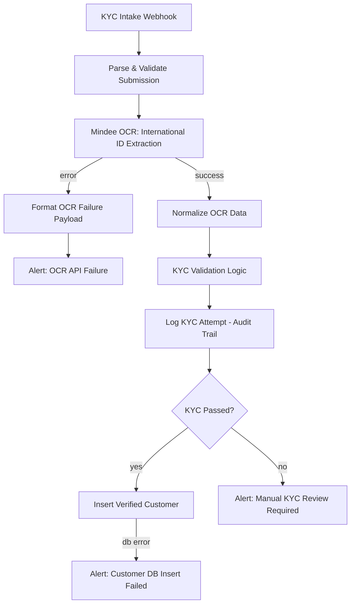

# KYC Pipeline — Automated Identity Verification with n8n + OCR

An end-to-end Know Your Customer (KYC) automation workflow built in [n8n](https://n8n.io). It accepts an applicant's profile and ID document via webhook, extracts identity data using OCR, runs compliance checks, logs every attempt for audit purposes, and routes the result automatically — verified customers get inserted into the database, flagged or failed cases get routed to a human reviewer on Slack.

This was built as an independent project to practice designing automation systems for compliance-heavy, real-world workflows.

## What it does

1. **Intake** — A webhook accepts a multipart form submission: applicant profile data (JSON) plus a photo/scan of an ID document.
2. **Validation & parsing** — Incoming data is checked and normalized before anything is sent to a third-party API, minimizing how much raw applicant data travels downstream.
3. **OCR extraction** — The ID document is sent to [Mindee's International ID API](https://www.mindee.com/), which extracts name, date of birth, document number, and expiry date from passports, national IDs, or driver's licenses.
4. **Business-rule validation** — The extracted data is checked against three rules:
   - Applicant is 18 or older (calculated to the exact day, not just by year)
   - The ID has not expired
   - A document number was actually extracted (low-confidence scans can return blank fields)
5. **Audit logging** — Every attempt — pass or fail — is logged to a Postgres audit table, independent of whether the customer record itself is created.
6. **Routing** — Passed applicants are inserted into the customer database. Flagged applicants trigger a Slack alert to a compliance review channel.

## Why it's built this way

A few deliberate design decisions worth calling out:

- **Technical failures and compliance failures are handled separately.** If the OCR API itself fails (timeout, rate limit, bad image), that's a system problem and triggers an engineering alert. If an applicant is underage or their ID is expired, that's a compliance flag and triggers a separate, distinct review alert. Conflating the two would mean a compliance reviewer wasting time on what's actually an API outage, or vice versa.
- **The audit log write is decoupled from the customer insert.** A logging hiccup should never block a real applicant from being processed — but it also should never silently disappear from the execution history.
- **A passed-but-unsaved applicant gets a dedicated, higher-urgency alert.** If someone clears every KYC check but the database insert fails, that's treated as more urgent than a routine manual review, since a verified customer is at risk of falling through the cracks entirely.
- **Only the minimum necessary fields are persisted long-term.** The customer table stores name, date of birth, and document number — not the raw OCR payload, not the document image, not contact details unless the schema calls for them.
- **The intake parser tolerates messy input.** It accepts a nested JSON `profile` object or flat form fields, and accepts the uploaded file under either `id_document` or `file` as the key — so a slightly different client implementation doesn't break the pipeline.
- **API calls and database writes both retry automatically** before falling back to an error path, since transient network blips shouldn't require a human to intervene.

## Stack

- **n8n** — workflow orchestration
- **Mindee API** — OCR / identity document extraction
- **PostgreSQL** — customer records + audit log
- **Slack API** — real-time alerting for manual review and technical failures

## Workflow diagram

## Repository contents

- `workflow.json` — the exportable n8n workflow (import directly into any n8n instance via **Workflows → Import from File**)
- This README

> **Note:** All credentials in `workflow.json` are referenced through n8n's built-in credential store (`mindeeInvoiceApi`, `postgres`, `slackApi`) and have been replaced with placeholder IDs for this public copy. No API keys, tokens, or passwords are stored in this file — connect your own credentials after importing.

## Try it yourself

1. Import `workflow.json` into n8n
2. Connect your own Mindee, Postgres, and Slack credentials
3. Set up a `customers` table and a `kyc_audit_log` table matching the fields referenced in the workflow
4. Send a test POST request to the webhook with a `profile` field and an `id_document` file
